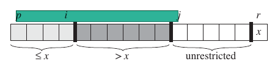

Basic

- [Heaps and priority queue](#heaps-and-priority-queue)
    - [Basic Procedures for heaps](#basic-procedures-for-heaps)
    - [Priority Queue with heaps](#priority-queue-with-heaps)
- [Quick Sort](#quick-sort)
    - [Performance analysis](#performance-analysis)
- [Linear Time sorting](#linear-time-sorting)
    - [Counting Sort](#counting-sort)
    - [Radix Sort](#radix-sort)
    - [Bucket sort](#bucket-sort)
- [Order statistics](#order-statistics)
- [Hash tables](#hash-tables)
    - [Collision resolution with chaining](#collision-resolution-with-chaining)
    - [Hash functions](#hash-functions)
        - [Division method](#division-method)
        - [Multiplication method](#multiplication-method)
        - [Universal hashing](#universal-hashing)
    - [Open Addressing](#open-addressing)
    - [C++ implementation](#c-implementation)

# Heaps and priority queue

- heaps can be implemented with arrays: `parent(i) = i>>1`, `left(i) = i<<1`, `right(i) = i<<1 + 1` (1-based index)
- heaps are of two types: max-heap & min-heap
- max-heap property: $A[parent(i)] \geq A[i]$
- heaps provide in-place, unstable sorting

## Basic Procedures for heaps

- **MAX_HEAPIFY**: if a node violates max-heap property but its children are max-heaps, then it makes the node float down to its appropriate position with $\mathcal{O}(\text{height of node})$ cost

```c++
int heap_size;

void max_heapify(vector<int> &arr, int i){
    int left = (i<<1) + 1, right = left + 1, largest;
    if(left < heap_size && arr[left] > arr[i]) largest = left;
    else largest = i;
    if(right< heap_size && arr[right] > arr[largest]) largest = right;
    
    if(largest != i){
        swap(arr[i], arr[largest]);
        max_heapify(arr, largest);
    }
}
```

- **BUILD\_MAX\_HEAP**: builds the heap from array
    - since second half of the array contain leaves of heap, which are one-element heaps so we call `max_heapify` on rest element in down-up manner
    - exactly $A[\frac{n}{2},n]$(0-indexed) are leaves so i here can be started with `arr.size()/2 - 1`

```c++
void build_max_heap(vector<int> &arr){
    heap_size = arr.size();
    for(int i = arr.size()/2; i>=0; i--) max_heapify(arr, i);
}
```

- time complexity of `build_max_heap`

$$
\sum\limits_{i=n/2}^{n}i\cdot {\mathcal{O} (h)} =  \sum\limits_{h=0}^{\lfloor lgn \rfloor} \lceil{ \frac{n}{2^{h+1}} \rceil}\mathcal{O} (h)
 = \mathcal{O}( n \sum\limits_{h=0}^{\lfloor lgn \rfloor} {\frac{h}{2^h}} )\\
 \text{here } \sum\limits_{h=0}^{\infty}  {\frac{h}{2^h}} = 2 \text{ because } \sum\limits_{k=0}^{\infty}  {kx^k} = \frac{x}{(1-x)^2} \text{ for } |x| \lt 1\\
 \text{so the cost is} = \mathcal{O}(n) 

$$

- **HEAP_SORT**:extract max element, put it in the last and reduce heap_size by 1; cost is $\mathcal{O} (n\lg n)$

```c++
void heap_sort(vector<int> &arr){
    build_max_heap(arr);

    for(int i = arr.size()-1; i>0; i--){
        swap(arr[0], arr[i]);
        heap_size--;
        max_heapify(arr, 0);
    }
}
```

## Priority Queue with heaps

- priority_queue contains key-value pairs and supports the following operations:
    - `INSERT(x)` insert element x in it
    - `MAX()` return element of it with largest key
    - `EXTRACT_MAX()` return and remove element of it with largest key
    - `INCREASE_KEY(x,k)` set element x's key equal to k assuming k is not less than x's current key
- we can chanage the element type from `int` to `pair<int,pointer_to_stored_object>` to have key-value pairs instead of just keys; pointer will make swapping element indexes easier(sizeof(ptr) = 8, sizeof(object) can be > 8)

```c++
int heap_max(vector<int> &arr){	//O(1)
    return arr[0];
}
int heap_extract_max(vector<int> &arr){ //O(lgn)
    if(heap_size == 0) exit(1);
    int max = arr[0];
    arr[0] = arr[heap_size-1];
    --heap_size;
    max_heapify(arr,0);
    return max;
}
int parent(int i){ return (i+1)>>1 - 1; }
void heap_increase_key(vector<int> &arr, int i, int key){ //O(lgn)
    if(key < arr[i]) exit(1);
    arr[i] = key;
    while(i > 0 && arr[parent(i)] < arr[i]){
        swap(arr[i], arr[parent(i)]);
        i = parent(i);
    }
}
void heap_insert(vector<int> &arr, int key){
    heap_size++;
    arr.push_back(INT_MIN);	//put at index (heap_size - 1)
    heap_increase_key(arr, heap_size-1, key);
}
```

- STL

```c++
//priority_queue default signature:
priority_queue<typename _T, typename _seq = vector<_T>, typename _compare = less<_seq::value_type>>
//max heap
priority_queue<int>
//min heap
priority_queue<int, vector<int>, greater<int>>
```

# Quick Sort

- worst case $\mathcal{O}(n^2)$ but the average case $\mathcal{O}(\lg n)$ is winner in practice
- in-place & unstable sorting
- divide and conquer strategy for sorting `A[p...r]`
    - partition the array in subarrays `A[p...q-1]` and `A[q+1...r]` such that first subarray contains elements smaller than or equal to `A[q]` and second contains greater than `A[q]`
    - sort the subarrays recursively
    - no need to combine the results

```c++
void quick_sort(vector<int> &arr, int l = 0,int r = INT_MIN){
    if(r == INT_MIN) r = arr.size();
    if(l >= r) return;
    int m = partition(arr,l,r);
    quick_sort(arr, l, m );
    quick_sort(arr, m + 1, r);
}
```

- random partitioning

```c++
int partition(vector<int> &arr, int l,int r){
    int ramdom_index = l + (rand() % (r-l));
    swap(arr[ramdom_index], arr[r-1]);
    int pivot = arr[r-1];
    int i = l-1;
    for(int j = l; j<r-1;j++){
        if(arr[j] <= pivot){
            i++;
            swap(arr[i], arr[j]);
        }
    }
    swap(arr[r-1], arr[i+1]);
    return i+1;
}
```



## Performance analysis

- worst-case paritioning: when one subproblem have 0 elements and other have n-1(array is already sorted) then

$$
T(n) = T(n-1) + T(0) + \Theta(n) = \Theta(n^2)

$$

- best-case

$$
T(n) =  	2T(n/2) + \Theta(n) = \Theta(n\lg n)

$$

- you'll see that even if partitions have size ratios 1:9, the running time is $\mathcal{O}(n\lg n)$ and there is more than 80% chance of the partitioning being better than the 1:9 ratio
- expected running time if one partition contain q elements

$$
T(n) =   T(q) + T(n-q-1) + \Theta(n)

$$

parition method is called atmost n time and if the number of comparisons done in line `arr[j] <= pivot` are $X$ then runtime of quick sort is $\mathcal{O}(n + X)$

- overall bound on $X$

two elements are compared at most once because once an element is compared to the pivot in some partitioning it won't be compared again

$$
\text{let indicator r.v. } X_{ij} =(\text{is } A_i \text{ compared to } A_j)\\
X = \sum\limits_{i=1}^{n-1} \sum\limits_{j=i+1}^{n} X_{ij}\\
\implies E[X] = \sum\limits_{i=1}^{n-1} \sum\limits_{j=i+1}^{n}E[ X_{ij}]\\

$$

once a pivot is x chosen and $A_i<x<A_j$ then its sure that $A_i$ and $A_j$ won't be compared. so $A_i$ and $A_j$ are compared if and only if first element chosen from $\{A_i, A_{i+1},...,A_j\}$ is either $A_i$ or $A_j$ so

$$
E[X_{ij}] =P(\text{is } A_i \text{ compared to } A_j)\\
= P(z_i \text{ or } z_j  \text{  is first pivot chosen from } \{A_i, A_{i+1},...,A_j\})\\
\ \\
\text{since all items are equally likey to be chosen so:}\\
E[X_{ij}] = \frac{2}{j-i+1}\\
\implies E[X] = \sum\limits_{i=1}^{n-1} \sum\limits_{j=i+1}^{n} \frac{2}{j-i+1} \\
\ \\
\text{let } k  = j - i:\\
E[X] = \sum\limits_{i=1}^{n-1} \sum\limits_{k=1}^{n-i} \frac{2}{k+1} \lt 
\sum\limits_{i=1}^{n-1} \sum\limits_{k=1}^{n} \frac{2}{k} \\
\implies E[X] = \sum\limits_{i=1}^{n-1} \mathcal{O} (\lg n)\\
\implies E[X] = \mathcal{O} (n\lg n)

$$

# Linear Time sorting

- non-comparison sorts(sorting order won't be determined by comparing keys of elements)

## Counting Sort

- assumes that keys of elements are in range 0 to k, cost $\mathcal{O}(n+k)$. When $k=\mathcal{O}(n)$, time complexity is also $\mathcal{O}(n)$

```c++
//sorting array containing only integer keys, max_key exclusive
vector<int> rapid_sort(const vector<int> &arr, int max_key){
    vector<int> count(max_key, 0), ret_array(arr.size());
    for(int i=0; i<arr.size(); ++i) ++count[arr[i]];

    int indx = 0;
    for(int i=0; i<=max_key; ++i)
        for(int j=1; j<=count[i]; ++j)
            ret_arr[indx++] = i;
    return ret_arr;
}
//sorting array containing integer keys and additional information
//somethigs can be changed to general type T and T.key
vector<int> count_sort(const vector<int> &arr, int max_key){
    vector<int> count(max_key, 0),ret_arr(arr.size());
    for(int i=0; i<arr.size(); ++i) ++count[arr[i]];
    for(int i=1; i<=max_key; ++i) count[i] += count[i - 1];
    
    for (int i = arr.size()-1; i>=0; --i){
        ret_arr[count[arr[i]]-1] = arr[i];
        --count[arr[i]];
    }
    return ret_arr;
}
```

## Radix Sort

| Intially | run I | run II | run III |
| --- | --- | --- | --- |
| 329 | 72 $0$ | 7 $2$ 0 | $3$ 29 |
| 457 | 35 $5$ | 3 $2$ 9 | $3$ 55 |
| 657 | 43 $6$ | 4 $3$ 6 | $4$ 36 |
| 839 | 45 $7$ | 8 $3$ 9 | $4$ 57 |
| 436 | 65 $7$ | 3 $5$ 5 | $6$ 57 |
| 720 | 32 $9$ | 4 $5$ 7 | $7$ 20 |
| 355 | 83 $9$ | 6 $5$ 7 | $8$ 39 |

- for n d-digit numbers with each digit having k possible values, RadixSort takes $\mathcal{O}(d(n+k))$ if the stable sort its using is $\mathcal{O}(n+k)$
- when d is constant and k is of order n, then it sots in linear time

```c++
//modified count sort
void count_sort(vector<int> &arr, int max_key,int factor){
    vector<int> count(max_key, 0);
    vector<int> ret_arr(arr.size(),0);

    for(int i=0; i< arr.size(); ++i){
        auto x = (arr[i]/factor) % 10;
     	count[x]++;
    }
    for(int i=1; i<max_key; ++i) 
     	count[i] += count[i - 1];

    for (int i = arr.size()-1; i>=0; --i){
        auto x = (arr[i]/factor) % 10;
        ret_arr[count[x] - 1 ] = arr[i];
        count[x]--;
    }
    arr = ret_arr;
}
void radix_sort(vector<int> &arr){
    int max_element = INT_MIN;
    for(auto x:arr) if(x > max_element) max_element = x;
    
    for(int i=1; max_element/i > 0; i*=10)
        count_sort(arr, 10,i);
}
```

## Bucket sort

- it assumes that input is from a uniform distribution
- have average case running time $\mathcal{O}(n)$
- this implementation for range $[0,1)$

```c++
void bucket_sort(vector<double> &arr){
    vector<vector<double>> buckets(arr.size());
    int n = arr.size();
    for(int i=0; i<n; ++i){
        int bucket_index = n * arr[i];
        buckets[bucket_index].push_back(arr[i]);
    }
    //insertion sort will also be ok
    for(int i=0; i<n; ++i) sort(buckets[i].begin(), buckets[i].end());
    
    int index = 0;
    for(int i=0; i<n; ++i)
        for(int j=0; j<buckets[i].size(); j++)
            arr[index++] = buckets[i][j];
}
```

- for general range
    - calculate `max_element` and `min_element` of array and `span = (max-min)/n`
    - change `bucket_index = (arr[i] - min_element) / span`
- analysis

$$
\text{let r.v. } n_i = \text{ number of elements in bucket } i\\
\text{so } T(n) = \Theta(n) + \sum\limits_{i=0}^{n-1}\mathcal{O}(n_i^2)\\
E[X] = \Theta(n) + \sum\limits_{i=0}^{n-1}\mathcal{O}\left(E[n_i^2]\right)\\
\text{now for calculating }E[n_i^2] \text{ let indicator r.v. } X_{ij} = A[j] \text{ falls in bucket i then}\\
n_i = \sum\limits_{j=0}^{n} X_{ij}
E[n_i^2] = E\left[\left( \sum\limits_{j=0}^{n-1} X_{ij} \right)^2 \right]\\
= \sum\limits_{j=0}^{n-1}E[X_{ij}^2] + \mathop{\sum\limits_{j = 0}^{n} \sum\limits_{k=0}^n }\limits_{k\neq j} E[X_{ij}X_{ik}]\\
X_{ij} \text{ is 1 with probability } 1/n  \text{ and 0 otherwise so}\\
E[X_{ij}^2] = 1^2\cdot (1/n) + 0^2(1-1/n) = 1/n\\
\text{ when } k\neq j, X_{ij} \text{ and } X_{ij} \text{ are independent, so}\\
E[X_{ij}X_{ij}] = 1/n^2\\
\implies E[n_i^2] = \sum\limits_{j=0}^{n-1}{\frac{1}{n}} + \mathop{\sum\limits_{j = 0}^{n} \sum\limits_{k=0}^n }\limits_{k\neq j} \frac{1}{n^2}\\
= 2 -\frac{1}{n}\\
\ \\
\implies E[X] = \Theta(n) + n\cdot \mathcal{O}(2-1/n) = \Theta(n) 

$$

# Order statistics

- max and min can simply be find by traversing whole array $\mathcal{O}(n)$
- max & min both together can be found by taking elements of array in pairs, comparing the two elements, comparing smaller one to min & larger one to max: this will cost 3 comparison per 2 elements. so the number of comparisons become $3n/2$ instead on $2n$
- selecting $i^{th}$ order statistics
    - sort and return $i^{th}$ element $\mathcal{O}(n\lg n)$
    - we can use a heap: with STL, we'll create priority_queue with first i elements of array, then for other elements, if the element if smaller than pq's top then remove the top and push the element. After doing it for whole array the top of pq will be the answer. $\mathcal{O}(i + (n-i)\lg k)$: first building i-element heap with linear complexity then (n-k) push-pops with logorithmic complexity

```c++
int tofindKthSmallest(vector<int> const &v, int k){
    priority_queue<int, vector<int>> pqueue(v.begin(), v.begin() + k);
    
    for (int i = k; i < v.size(); i++){	
        if (v[i] < pqueue.top()){
            pqueue.pop();
            pqueue.push(v[i]);
        }
    }
    return pqueue.top();
}
```

- with heaps we can also find the smallest/largest i elements of the array

# Hash tables

- direct addressing: having array that have one position for every key possible, key works as index(large space needed or number of keys should be small).
    
- provides constant time operations: insert, delete, seach
    
- `T[k]` contains element with key k, or null if element with key k is not present in the array.
    
- hash table: stored array size proportional to keys actually stored(which is smaller than total number of keys)
    
- keys are not used as index, but index is computed from key with hash functions
    
- if $U$ is universe of keys and $\{0,1,...,m-1 \}$ are indexes, then hash function $h:Y\rightarrow \{0,1,...,m-1 \}$ maps keys to indexes, element with key $k$ hashes to index $h(k)$
    

## Collision resolution with chaining

- collision: when two keys maps to the same index
- chaining: elements with same keys are put in linked list referenced at that index
- because of this, insertion and deletion operations can take $\mathcal{O}(n)$ in worst case(when all of keys map to the same index)
- average case analysis
    - load factor $\alpha =$ number of elements / number of slots(indexes) $= n/m\\ =$ average number of elements stored in a chain
    - in case of uniform hashing(elements are equally likely to go in all m slots) the average case cost is $\mathcal{O}(1+\alpha)$

## Hash functions

- A good hash function satisfies (approximately) the assumption of simple uniform
    hashing: each key is equally likely to hash to any of the m slots, independently of
    where any other key has hashed to
- for example hashed value of keys 'pt' and 'pts' shouldn't be same. Sometimes we might stronger properties like hash values of 'close' keys should be far apart
- hash functions assume that keys are natual numbers(if they're not, then we interpret them as natural numbers)

### Division method

$$
h(k) = k \text{ mod } m

$$

- a good value of m should be chosen, a prime not too close to an exact power of 2 is a good choice

### Multiplication method

- multiply key by a fraction, take its fractional part and multiply with m. Then take the floor of it.

$$
h(k) = \lfloor m(kA \text{ mod } 1) \rfloor,\quad 0<A<1

$$

- advantage: value of m is not critical
- easy computational:
    - let $w$ be word size of machine and $k$ fits in $w$ bits
    - we can take m to be a power of 2 ($2^p$ for some $p$) and restrict A to be a fraction of type $s/2^w$ where $0<s<2^w$
    - then first we multiply $k$ with $s = A\cdot 2^w$ which results in $r_12^w+r_2$
    - $r_2$ represent $kA \text{ mod } 1$(because if we divide the above result by $2^w$, $r_1$ will be integer part and $r_2$ will be fractional part)
    - muliplying $r_2$ with $m=2^p$ is equivalent to taking most significant $p$ bits of it. So most significant $p$ bits of $r_2$ is the hash value
    - Knuth suggests $A\approx (\sqrt{5} - 1)/2=0.6180339...$

### Universal hashing

- hash function chosen randomly each time from a collection of hash functions.
- handler can chose a single hash function for a hash table, rehash the table with another random hash function when there are many collisions etc.
- A collection of hash functions $\mathcal{H}$ is called universal if for a pair of keys $k,l$ the number of hash functions that hash these keys to same value are at most $|\mathcal{H}|/m$
- that means chance of collision of two keys is at most $\frac{|\mathcal{H}|/m}{|\mathcal{H}|}= 1/m$(which is equal to chance of collision of two random keys from set $\{0,1,2,...,m-1 \}$)
- since on each operation, a different hash function will be used, cost of $n$ operations(insert, search delete) is $\Theta(n)$ on hash table containing $\mathcal{O}(m)$ elements
    - probability of collision of two keys is $1/m$
    - expected value of number of keys other than $k$, that hash to to same value as $k$ is $n/m = \alpha$
    - so operations cost $\Theta(\alpha)$
- universal hash functions

let p is a prime number greater than every possible key, $\mathcal{Z}_p = \{0,1,2,...,p-1 \}, \mathcal{Z}_p^* = \{0,1,2,...,p-1 \}$,
so $k\in \mathcal{Z}_p$ and $p>m$

$$
h_{ab}(k) = 	((ak+b) \text{ mod } p) \text{ mod } m\\
\text{}\\
\mathcal{H}_{pm} = \{h_{ab}: a\in\mathcal{Z}_p^* , b\in\mathcal{Z}_p \}

$$

- $\mathcal{H}_{pm}$ contains $p(p-1)$ hash functions
- $\mathcal{H}_{pm}$ is universal

let $k,l\in \mathcal{Z}_p, k\neq l$
for a given hash function $h_{ab}$

$$
r = (ak+b) \text{ mod } p\\
s =(ak+b) \text{ mod } p\\
r-s \equiv a(k-l) (\text{ mod } p)

$$

so $r\neq s$ because $p$ is prime and both $a$ and $k-l$ are nonzero modulo p, so there product is also nonzero modulo p
so pairs of $(k,l)$ and $(r,s)$ have one to one correspondence

the probability that $k$ and $l$ collide is probability that $r\equiv s(\text{mod } m)$ where r and s are random and distinct values modulo
for given $r$, number of values $s$ ($p-1$ total possible), such that $r\equiv s(\text{mod } m)$ is $\lceil p/m\rceil -1$
since $\lceil \frac{a}{b}\rceil \leq \frac{a+(b-1)}{b}$

$$
\lceil p/m\rceil -1 \leq (p-1)/m

$$

the probability of $r$ and $s$ being congruent modulo $m = \frac{(p-1)/m}{p-1} = 1/m$
so probability of collision is $1/m$

## Open Addressing

- instead of following pointers to find an item(as in chaining), we compute the sequence of slots to be examined and look in them.
- the sequence, instead of being order $0,1,2,...,m-1$ which will require linear search time, the sequence depends on the key being inserted. So the hash function here is

$$
h: U \times \{0,1,...,m-1 \} \rightarrow \{0,1,...,m-1 \}

$$

- we also require that for every key $k$, the probe sequence $\langle h(k,0),h(k,1), ..., h(k,m-1) \rangle$ be a permutation of $\langle 0,1,2,..,m-1\rangle$, so every position is considered a slot to insert the new key.

## C++ implementation

```
//Bob Jenkins
int joaat_hash(uchar *key, int len){
    int hash = 0, i;
    for (i = 0; i < len; i++){
        hash += key[i];
        hash += (hash << 10);
        hash ^= (hash >> 6);
    }
    hash += (hash << 3);
    hash ^= (hash >> 11);
    hash += (hash << 15);
    return hash;
}
```